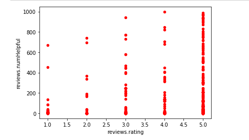

# Analyzing the Review of Amazon’s Kindle

Dataset 1: https://www.kaggle.com/smid80/weatherww2  
Dataset 2: https://www.kaggle.com/uciml/red-wine-quality-cortez-et-al-2009  

The New York Times reported that over 80 percent of Americans read online reviews before making new purchases, considering them to be informative and accurate. I decided to analyze the consumer reviews on Amazon’s Kindle to show the variance in the data.

This dataset has about 1,500 reviews of the Amazon Kindle and contains variables such as the review, its rating, title,usernames, etc. From this data I was able to evaluate a sentiment score on whether a review was negative or positive and then use that score and compare it to the ratings given on reviews. Some users added a review without a rating and vice versa which led to some of the data being removed from the analysis.

##Frequency in Rating
Five Stars was the most popular choice among users as over 700 reviews had that rating which skews the data to the left. Five star reviews were found to be about 50% helpful to other users who wanted to make a product purchase. One Star had the lowest frequency and were found the least helpful.

