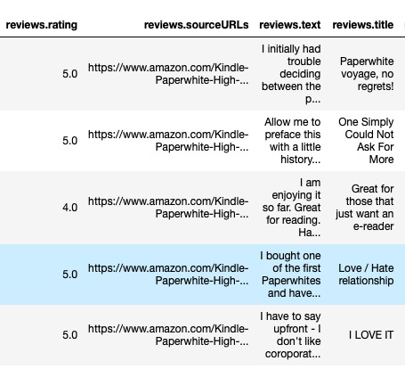

# Analyzing the Review of Amazon’s Kindle

Dataset 1: https://www.kaggle.com/smid80/weatherww2  
Dataset 2: https://www.kaggle.com/uciml/red-wine-quality-cortez-et-al-2009  

The New York Times reported that over 80 percent of Americans read online reviews before making new purchases, considering them to be informative and accurate. I decided to analyze the consumer reviews on Amazon’s Kindle to show the variance in the data.

This dataset has about 1,500 reviews of the Amazon Kindle and contains variables such as the review, its rating, title,usernames, etc. From this data I was able to evaluate a sentiment score on whether a review was negative or positive and then use that score and compare it to the ratings given on reviews. Some users added a review without a rating and vice versa which led to some of the data being removed from the analysis. 

  

## Frequency in Rating  
Five Stars was the most popular choice among users as over 700 reviews had that rating which skews the data to the left. Five star reviews were found to be about 50% helpful to other users who wanted to make a product purchase. One Star had the lowest frequency and were found the least helpful.

  

## Sentiment Analyzer
To create the Sentiment Analyzer I used text files of positive/negative words and searched through the language in each review to find correlation between the two. A value of 0 would be very negative review , 1 says a very positive. review and 0.5 was nuetral.
The average review had a negative sentiment even though the most common rating was 5 star. The line of best fit for the data is just below half at 0.41. I then found the length and synthesized that shorter reviews had a more postive sentiment whereas longer review had a higher extent of negative sentiment.

Although 5 stars was the most common rating the written review, the average review had a negative sentiment. This can be due to many factors including users adding words with negative connotation The mean sentiment score of all reviews was 0.4. This could be due to many reasons including consumers being satisfied with their products but offering imporvements. One user Dougal, gave the Kindle a 5 Star rating but wrote that he had a “love/hate relationship” with the product. Words like hate will decrease the sentiment score.

  

## Fake Reviews

A growing problem for product reviews on Amazon are the use of bots to create fake positive reviews to help boost a product listings in search results and increase sales. Amazon has been using Machine Learning to find and delete fake reviews. The also added a “Verified Purchase” badge onto user reviews to establish authenticity in user reviews. Additionally, the website FakeSpot is a tool which uses Machine Learning to try and find reviews that are made by bots.

